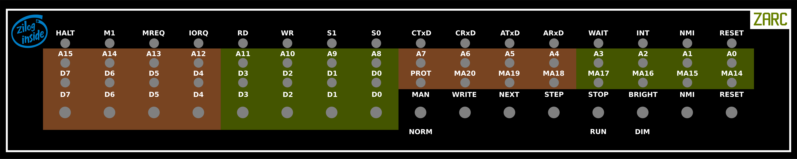

# ZARC

## Overview
The Z80 Anachronistic Retro Computer (ZARC) is a Zilog Z80-based 8-bit computer. Some features were inspired by a number of other machines, including the DEC PDP-8, BBC Microcomputer and Sinclair Spectrum.

Front Panel

The most significant features are:

* Zilog Z80 CPU running at 8 MHz.
* Physical front panel with LEDs (“blinkenlights”) and switches.
* 1 MB of battery-backed static RAM with write protection. This simulates core memory, allowing use of techniques previously used on such machines.
* A flexible memory mapping system is used to map the RAM into the 16-bit space directly addressable by the CPU.
* The core computer is a mixture of CMOS and TTL with no programmable logic.
* I/O is implemented in an Altera Cyclone II FPGA.
* NMI-based single-step for software debugging, including the capability of debugging interrupt routines.

I/O includes:

* Two RS-232 ports.
* Real time clock (RTC).
* MMC memory card interface.

Software features include:

* Monitor with disassembler and memory page management.
* CP/M 2.2 using MMC card for file storage.
* File system checker (fsck)
* File transfer over serial link (stran)
* ZX81 emulator (zx81)
* Bitcoin miner (bitcoin)

The CP/M system is capable of running most widely available CP/M software.

## Documentation
* [Hardware](hardware/HardwareGuide.pdf)
* [Monitor](software/monitor/MonitorGuide.pdf)
* [CP/M, including BIOS and installation](software/cpm/CPM_Guide.pdf)
* [File system checker](software/cpm/cpm_dev/fsck/fsckGuide.pdf)
* [File transfer over serial link](software/tools/stran/STranGuide.pdf)

## History
When I was at school many years ago in the era of Sinclair ZX81s and BBC Microcomputers, I built two Z80 machines. The first was called "Phoenix I", and was a simple single-board machine with very limited capabilities. The I/O was six 7-segment filament displays, a re-purposed calculator keypad and (later) a three-channel sound chip. This was later dismantled and the parts re-used for the "Phoenix 2". This was a much more sophisticated machine, with 192 KB of RAM, a "high resolution" (256 x 192) two bits per pixel video display, a full alphanumeric keyboard and data storage on cassette tape. It ran a modified Sinclair Spectrum basic, and a modified version of a game called Manic Miner. Unfortunately, I have nothing left of either of these machines.

ZARC could reasonably have been called "Phoenix 3", though I think ZARC is slightly more imaginative. In part, this is the machine I would like to have had in the 1980s. Both hardware and software are much more sophisticated, and the visual appeal of a "proper" front panel is nice. Lockdowns associated with the COVID-19 plague gave me the opportunity to make this machine a reality.
